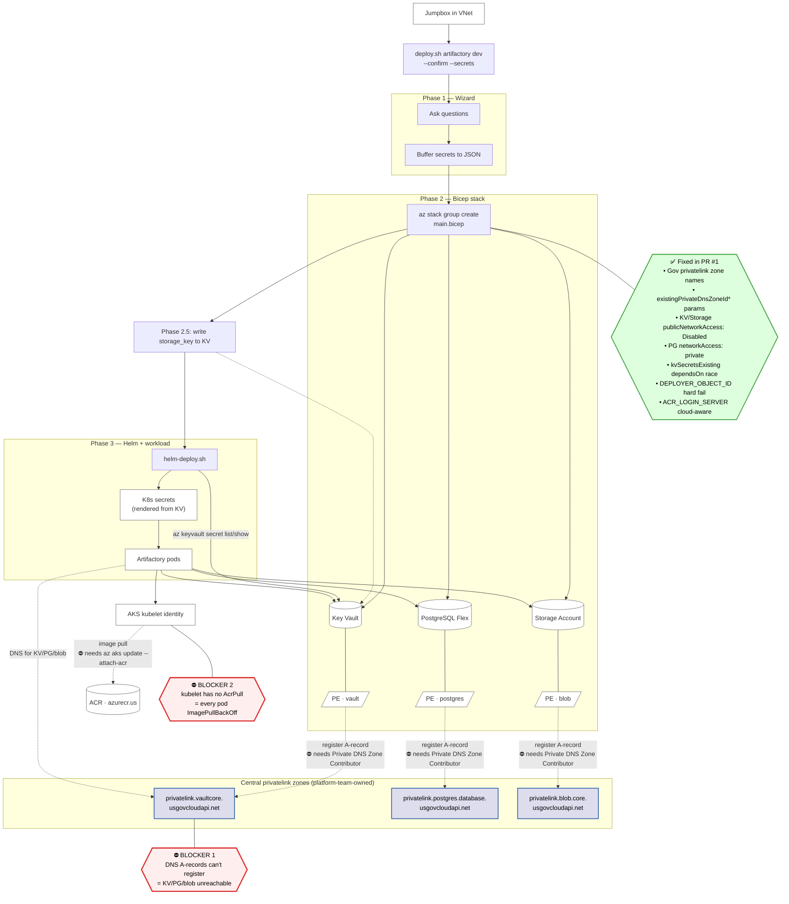

# Deployment Flow & Current Blockers

Visualizes the full path from `deploy.sh` on the jumpbox to running pods, with the two platform-team prerequisites that gate end-to-end success called out explicitly. See [ISSUES.md](./ISSUES.md) for the failure-mode index and [CHEATSHEET.md](./CHEATSHEET.md) for the day-to-day commands.

## How to read it

- **Blue boxes** are owned by the platform team. The deployer can't write to them with PIM-Contributor on the deploy RG.
- **Red dashed lines + ⛔ callouts** are the two unresolved blockers. Both clear with one platform-team action each; neither is a code issue.
- **Green callout** lists what `PR #1` ships. Code-side this is done; deploy still won't succeed end-to-end until both ⛔ items clear.

## Story in one sentence

`deploy.sh` from the jumpbox creates KV / PG / Storage and their PEs cleanly with PIM-Contributor — but the PEs can't register their DNS A-records (blocker 1), so pods can't resolve the resources, and even if DNS resolved, kubelet can't pull the images that run those pods (blocker 2).

## Platform-team asks (paste-ready)

1. **`Private DNS Zone Contributor`** on the four central privatelink zones (vaultcore, postgres, blob, plus `azurecr.us` if ACR is private). Scope: the zone itself, not its parent RG.
2. **One-time** `az aks update -g <AKS_RG> -n <CLUSTER> --attach-acr <ACR>` so the kubelet identity gets `AcrPull` on the ACR.

Both items unblock every service on the cluster, not just artifactory — once granted, they don't need to be re-granted per-deploy.